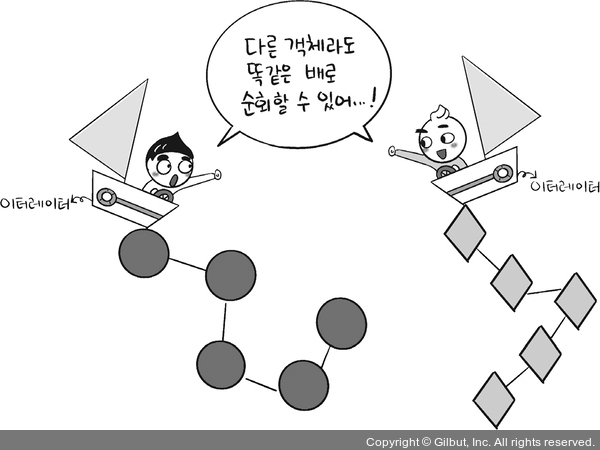
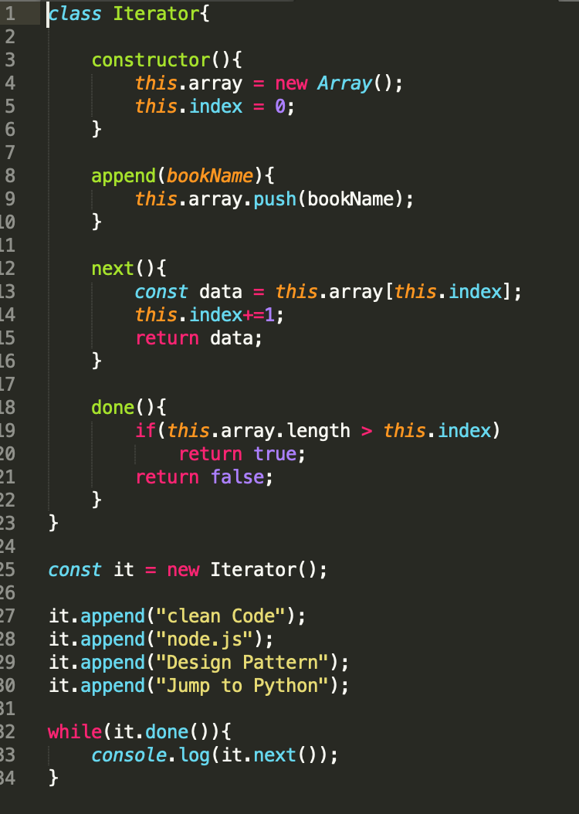

<h1> 이터레이터 패턴(iterator pattern) <h1>

- 이터레이터(iterator)를 사용하여 컬렉션(collection) 의 요소들에 접근하는 디자인 패턴
- 이터레이터 패턴을 쓰면 컬렉션(집합) 내에 구현이 어떤지몰라도 해당 객체에 접근해 반복 작업을 처리할 수 있음
- 순회할 수 있는 여러 가지 자료형의 구조와는 상관없이 **이터레이터라는 하나의 인터페이스로 순회 가능**

<h2>이터레이터 패턴 구성</h2>
1. Iterator 인터페이스
2. Collections 인터페이스

<h2>1. 자바스크립트에서의 이터레이터 패턴</h2>

<h6> 참조 : https://hoony-gunputer.tistory.com/entry/designPatten-Iterator%EC%9D%B4%ED%84%B0%EB%A0%88%EC%9D%B4%ED%84%B0-by-java-python-javascript </h6>

<h3> 1.1 동작과정 </h3>
1. Iterator 클래스 안에 배열에 임의의 값 삽입
2. while이 돌면서 done이 True일 때까지(인덱스가 배열 길이보다 작을 때까지)
3. next() 함수 실행(배열을 순서대로 돌면서 반환)

<h2>2. 파이썬에서의 이터레이터 패턴</h2>

- 파이썬은 매직 메서드로 `iter`와 `next`가 탑재되어 있어 구현이 간단

<h3> 3.1 동작과정 </h3>
1. Iterator와 Aggregate 인터페이스를 만듦
2. 이를 구현하고 있는 클래스 BookShelf, BookShelfIterator를 만듦
3. BookShelfIterator

https://brownbears.tistory.com/566

<h2>용어</h2>

<h3>이터레이터 프로토콜</h3>

- 이터러블한 객체들을 순회할 때 쓰이는 규칙
  - `for (let a of b)`, `for i in range(n):` 등
  

<h3>이터러블한 객체</h3>
- 반복 가능한 객체로 배열을 일반화한 객체

<h2>효과</h2>
- 모든 항목에 일일이 접급하는 작업을 컬렉션 객체가 아닌 이터레이터 객체에서 맡음
- 집합체의 인터페이스 및 구현이 간단해짐
- 집합체에서는 반복작업에서 손을 떼고 원래 자신이 할 일에만 전념할 수 있음