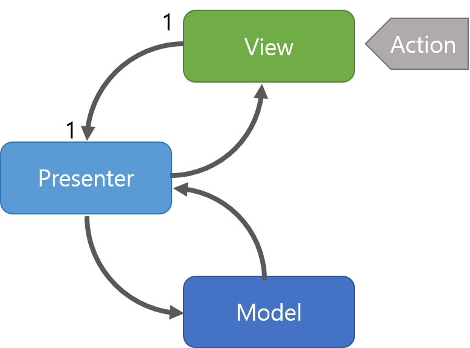

# 1.1.9 MVP 패턴

## MVP 패턴이란?
- Model + View + **Presenter**를 합친 용어

## 구조

- **Model** : 어플리케이션에서 사용되는 데이터와 그 데이터를 처리하는 부분
- **View** : 사용자에서 보여지는 UI 부분
- **Presenter** : **View에서 요청한 정보로 Model을 가공하여 View에 전달**해 주는 부분, View와 Model을 붙여주는 접착제 역할

## 동작

1. 사용자의 Action들은 View를 통해 들어오게 됨
2. View는 데이터를 Presenter에 요청
3. Presenter는 Model에게 데이터를 요청
4. Model은 Presenter에서 요청받은 데이터를 응답
5. Presenter는 View에게 데이터를 응답
6. View는 Presenter가 응답한 데이터를 이용하여 화면을 나타냄

## 특징
- **Presenter는 View와 Model의 인스턴스를 가지고** 있어 **둘을 연결**하는 접착제 역할을 함
- **Presenter와 View는 1:1 관계** (MVC 패턴보다 더 강한 결합을 지닌 디자인 패턴)

## 장점
- MVP 패턴의 장점은 **View와 Model의 의존성이 없다**는 것
- MVP 패턴은 MVC 패턴의 단점이었던 View와 Model의 의존성을 해결 (Presenter를 통해서만 데이터를 전달 받기 때문)

## 단점
- MVC 패턴의 단점인 View와 Model 사이의 의존성은 해결되었지만, **View와 Presenter 사이의 높은 의존성**을 가지게 되는 단점이 있음
- 어플리케이션이 복잡해 질 수록 View와 Presenter 사이의 의존성이 강해지는 단점이 있음

