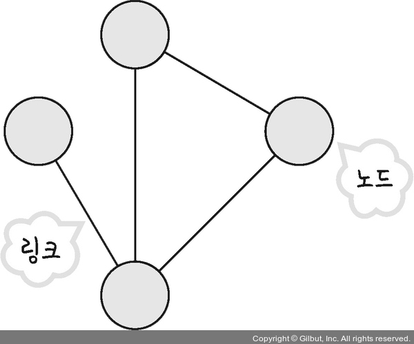

## 0. 네트워크란?

> **네트워크**: 노드(node)와 링크(link)가 서로 연결되어 있으며 리소스를 공유하는 집합

 

- **노드**: 서버, 리우터, 스위치 등 네트워크 장치 

- **링크**: 유선 또는 무선
- 네트워크를 구축할 때 "좋은" 네트워크로 만드는 것이 중요
- 좋은 네트워크: 많은 **처리량** 처리할 수 있으며, **지연 시간**이 짧고, 장애 빈도가 적으며, 좋은 보안을 갖춘 네트워크 (ex> 와이파이)
   

# 처리량과 지연 시간

## 1. 처리량

> **처리량(throughput)**: 링크를 통해 '전달'되는 단위 시간당 데이터양으로 단위로 bps(bits per second)를 쓴다. (초당 전송 or 수신되는 비트 수)

 

- 처리량은 사용자들이 많이 접속할 때마다 커지는 **트래픽, 네트워크 장치 간의 대역폭, 네트워크 중간에 방생하는 에러** 등에 영향을 받는다. 

- **트래픽(traffic)**: 서버와 스위치 등 네트워크 장치에서 일정 시간 내에 **흐르는** 데이터의 양
- **대역폭**: 주어진 시간 동안 네트워크 연결을 통해 흐를 수 있는 **최대 비트 수**
  

## 2. 지연 시간

> **지연 시간(latency)**: 요청이 처리되는 시간을 말하며 어떤 메시지가 두 장치 사이를 왕복하는 데 걸린 시간을 말한다.

  

---
