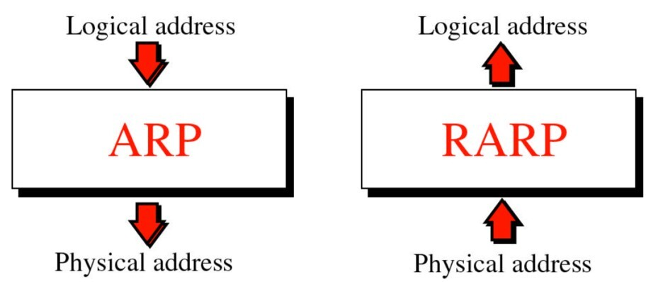
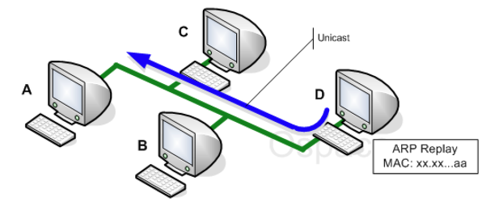

# ARP
## 1. ARP
### 1.1 ARP(Address Resolution Protocol)
- 주소 결정 프로토콜
- IP 주소를 통해 그 주소에 맞는 MAC 주소를 가지고 오는 프로토콜

### 1.2 RARP(Reverse Address Resolution Protocol)
- 역순 주소 결정 프로토콜
- MAC 주소를 통해 그 주소에 맞는 IP 주소를 가지고 오는 프로토콜

## 2. IP주소와 MAC주소
### 2.1 IP 주소 (Internet Protocol)
- 네트워크를 식별하는 논리적 주소 (L3, 네트워크 계층)
- LAN 카드에 연결되어 있는 회선(랜선)의 주소
- 고정되어 있는 것이 아니라 인터넷망에 접속할 때마다 달라짐

### 2.2 MAC 주소 (Media Acess Control)
- 물리적 네트워크 주소 (L2, 데이터링크 계층)
- LAN 카드, 즉 하드웨어에 할당된 고유 식별번호 주소
- 공장에서 출고될 때부터 부여되고 평생 사용하는 고유한 주소(고정된 주소)

### 2.3 IP 주소와 MAC 주소의 차이
- IP 주소는 PC의 네트워크에 할당된 주소, MAC은 기기 자체에 할당된 주소

## 3. ARP 동작 과정
### 3.1 ARP 동작 과정
0. 전제조건 : 두 단말간 통신을 할 때는 MAC 주소를 통해 데이터가 전달됨
	- MAC  주소가 전 세계에서 유일한 실제 목적지의 주소이기 때문
	- 따라서, 네트워크 통신을 위해서는 목적지의 **MAC 주소**를 알아야 함
1. ARP 요청 (Request)
	1. 송신자는 본인의 출발지 MAC + 출발지 IP + 목적지 IP의 정보를 가짐
	2. 목적지 IP 주소를 지정해 하나의 네트워크에 연결되어 있는 모든 PC들에게 ARP 요청 메시지를 생성하도록 요청함
	3. ARP 요청을 브로드캐스트 함
2. 프레임 수신
	1. 네트워크에 연결되어 있던 모든 PC들은 이 프레임을 수신함
	2. IP 주소가 맞지 않는 PC들은 수신받은 프레임을 버리고 , 맞는 PC만 응답을 보냄
3. ARP 응답 (Reply)
	1. IP 주소가 맞는 PC는 송신자에게 본인의 MAC 주소를 추가
	2. 응답을 유니캐스트 함

### 3.2 브로드캐스트, 유니캐스트
- 브로드캐스트 :  로컬 네트워크에 연결되어 있는 모든 시스템에게 프레임을 보내는 방식 (1:N)
- 유니캐스트 : 정보를 전송하기 위한 프레임에 자신의 MAC 주소와 목적지의 MAC 주소를 첨부하여 전송하는 방식 (1:1)
- **요청은 브로드캐스트, 응답은 유니캐스트**

### 3.2 ARP를 사용하는 이유
- 만약 MAC 주소로만 통신을 하면 모든 라우터들은 전세계 모든 서버들의 MAC 주소를 다 가지고 있어야 함. 즉, 모든 MAC 주소에 대해 라우팅 해줘야 함 
- 하지만 IP 주소 체계는 변경 가능하고, 라우팅하는데 효과적임
- 결론 : MAC 주소는 하드웨어 고유 주소이고 대부분 변경하지 않으므로 라우팅이 힘듦