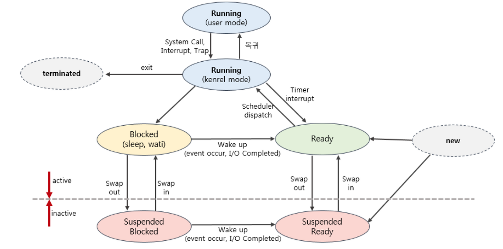

# 3.3.2_프로세스의 상태
- 프로그램 실행의 의미
	1.  파일 시스템에 존재하던 실행파일이 **메모리에 적재**된다는 의미
	2.  프로그램이 **CPU를 할당받고 명령을 수행하고 있는 상태**

- 파일 시스템에 있는 실행 파일이 메모리에 적재될 때, 실행파일 전체가 메모리에 올라가지 않음. 일부분만 메모리에 올라가고 나머지는 디스크의 특정영역인 스왑 영역에 존재.

## 1. 생성(create)
- 프로세스를 생성하고 있는 단계
- 커널 공간에 PCB가 만들어진 상태
- PCB란?
	 - 프로세스 제어 블록(Process Control Block)은 프로세스를 실행하는 데 필요한 정보를 보관하는 자료구조
	 - 프로그램이 메모리에 올라와 이 PCB를 얻었을 때 비로소 프로세스가 됨
	 - 모든 프로세스는 고유의 PCB를 가지며, 프로세스 생성 시 만들어져서 종료시 폐기
### 1.1 fork()
- 부모 프로세스의 주소 공간을 그대로 복사해서 새로운 자식 프로세스를 생성
- 주소 공간만 복사, 부모 프로세스의 작업을 상속하지는 않음
### 1.2 exec()
- 주소를 복사하지 않고 새롭게 프로세스를 생성

## 2. 대기(ready)
- 프로세스가 메모리에 적재된 상태로 실행하는데 필요한 자원을 모두 얻은 상태
- 아직 CPU를 받지는 않았지만 CPU를 할당 받으면 바로 실행 가능한 상태

## 3. 실행(running)
- 프로세스가 CPU를 할당받아 명령어를 수행중인 상태
- 일반적으로 CPU가 하나이기 때문에, 여러 프로세스가 동시에 실행되도 실제로 실행중인 프로세스는 매 시점 하나 뿐임

## 4. 종료(terminated)
### 4.1 자발적 종료
- 프로세스가 마지막 명령을 수행한 후 exit()를 이용해 알려줌
- 프로세스의 실행이 완료되고 할당된 CPU를 반납, 커널 공간 내의 PCB는 남아있음
### 4.2 비자발적 종료(abort)
- 한 프로세스가 다른 프로세스의 종료를 유발하여 강제로 종료됨

## 5. 중지(suspended)
- 메모리를 강제로 뺏긴 상태로 특정한 이유로 프로세스의 수행이 정지된 상태를 의미
- 외부에서 다시 재개시키지 않는 이상 다시 활성화 될 수 없음
### 5.1 suspended ready
-  준비 상태에 있던 프로세스가 디스크로 스왑아웃되며 수행 정지
### 5.2 suspended blocked
- 봉쇄 상태에 있던 프로세스가 디스크로 스왑아웃되며 수행 정지

## 6. 봉쇄(blocked)
### 6.1 봉쇄
- CPU를 주어도 당장 프로세스를 수행할 수 없는 상태
 - 프로세스가 요청한 이벤트(ex: I/O)가 즉시 만족되지 않아 이를 기다리는 상태
	 - ex) 디스크에서 file을 읽어와야 하는 경우
### 6.2 blocked와 suspended의 차이
- blocked : 잠시 중지되어 있다(blocked) 끝나면 다시 ready상태로 돌아옴, 프로세스 작업이 수행되고 있는 상태
- suspended : 잠시 중지되어 있다(suspendedn) 반드시 누군가가 재개시켜줘야 다시 ready상태로 돌아옴, 프로세스 수행 자체가 외부에 의해 정지된 상태