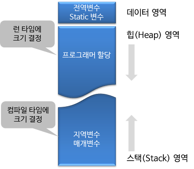

# 3.3.3_프로세스의 메모리 구조
-  프로세스의 주소 공간은 코드, 데이터, 스택, 힙으로 구성
- 이러한 주소 공간을 가상 메모리(논리적 메모리) 라고 함

## 1 코드(code)
- 실행할 프로그램의 코드가 저장됨
- 프로그램 실행 시 CPU는 이 영역에서 명령어를 하나씩 가져와 처리
- **읽기 전용 영역**이기에 프로세스가 함부로 변경 할 수 없고 변경 시 오류를 발생시킨다.

## 2. 데이터(data)
- 전역 변수와 정적 변수가 저장됨
- 이 변수들은 프로그램이 시작될 때 할당되어 프로그램 종료 시 소멸
- BSS(Block Stated Symbol)
	- 초기화 되지 않은 전역 변수가 저장됨
-   BSS영역, Data영역을 구분하는 이유
    -   초기화 된 데이터는 초기 값을 저장해야 하므로 Data 영역에 저장되어 rom에 저장된다. 하지만 초기화 되지 않은 데이터 까지 rom에 저장되면 큰 size의 rom이 필요하므로 구분한다. (초기화 되지 않은 데이터는 ram에 저장)

## 3. 스택(stack)
- 프로그램이 자동으로 사용하는 메모리 영역
- 지역 변수, 매개 변수, 리턴값 등 잠시 사용되었다가 사라지는 데이터가 저장됨
- 함수 호출 시 할당되었다가 함수 반환 시 소멸됨
- 메모리의 높은 주소에서 낮은 주소 방향으로 할당

## 4. 힙(heap)
- 동적 데이터 영역
-  할당해야 할 메모리의 크기를 프로그램이 실행되는 동안 결정해야 하는 경우(런 타임때) 유용하게 사용되는 공간
- - 프로그램 동작 시에 크기가 결정됨
- 메모리 주소값에 의해서만 참조되고 사용되는 영역
- 메모리의 낮은 주소에서 높은 주소로 할당
-  stack과 heap영역은 같은 공간을 공유함
	- 각 영역이 상대 공간을 침범하는 일이 발생할 수 있는데 이를 각각 `stack overflow`, `heap overflow` 라고 함