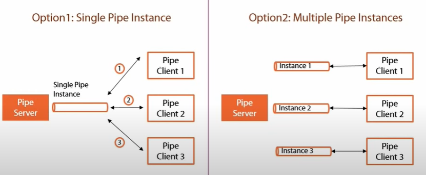

# 멀티 프로세싱

- 여러 개의 프로세서가 서로 협력적으로 일을 처리(병렬 처리)하는 것
- **IPC(Inter Process Communication)**가 가능함
    - 프로세스끼리 데이터를 주고받고 공유 데이터를 관리하는 메커니즘

## 1. 장점

1. 여러개의 단일 프로세싱보다 `비용을 절약`할 수 있음
    - 프로세서가 주변장치, 대용량 저장장치, 전원공급장치를 서로 공유하고 있기 때문
    - 중복되는 연산이나 처리 정보를 공유할 수 있음
2. 하나의 프로세서가 고장나더라도 시스템이 정지하는 것이 아니라 속도가 느려질 뿐, 안전함 `신뢰성 증가`
    - 예 : 웹 브라우저에서 여러개의 랜더러 프로세스를 사용함으로써 하나의 탭이 무응답상태가 되더라도 해당탭만 닫으면 됨

## 2. 웹 브라우저

### 2.1 브라우저 프로세스

- 차상위 프로세스로, 다른 프로세스들을 조율함
- 주소 표시줄, 북마크 막대, 뒤로가기 버튼, 앞으로 가기 버튼, 등을 담당
- 네트워크 요청이나 파일 접근 같은  권한을 담당함

### 2.2 렌더러 프로세스

- 웹 사이트가 디스플레이될 때 탭 안의 모든 것을 담당
- 웹 사이트가 보이는 부분의 모든 것을 제어

### 2.3 플러그인 프로세스

- 웹사이트에서 사용하는 플러그인을 제어

### 2.4 GPU 프로세스

- GPU를 이용해서 화면을 그리는 부분을 제어

## 3. IPC(Inter Process Communication)

- 프로세스끼리 데이터를 주고받고 공유 데이터를 관리하는 메커니즘
- 예 : 클라이언트 - 서버
- 종류 : 공유 메모리, 파일, 소켓, 익명 파이프, 명명 파이프, 메시지 큐 등
    - 메모리가 완전히 공유되는 스레드보다 속도가 떨어짐

> 이걸  왜하냐?
> 프로세스는 스레드와 달리 통신할 공간이 없기 때문에 별도의 공간이 필요해서 스레드간의 통신보다 어려움

### 3.1 공유 메모리(shared memory)

- 여러 프로세스에 **동일한 메모리 블록에 대한 접근 권한이 부여**되어 프로세스가 **서로 통신**할 수 있도록 **공유 버퍼를 생성**하는 것
- IPC 방식 중 하나인 메모리 자체를 공유하기 때문에 데이터 복사의 오버헤드가 발생하지 않아 `가장 빠르다`는 특징
- 여러 프로세스가 같은 메모리 영역을 공유하기 때문에 `동기화가 필요함`

> [참고] 하드웨어 관점에서 공유메모리는 CPU가 접근할 수 있는 큰 랜덤 접근 메모리인 RAM을 가르키기도 함

### 3.2 파일

- 디스크에 저장된 데이터 또는 파일 서버에서 제공한 데이터
- 이를 기반으로 프로세스 간 통신을 함

### 3.3 소켓

- 동일한 컴퓨터의 다른 프로세스나 네트워크의 다른 컴퓨터로 네트워크 인터페이스를 통해 전송하는 데이터
- **종류**
    1. TCP(Transmission Control Protocol) : 전송 제어 프로토콜. 서로 확인 메세지를 주고받으면서 통신신뢰성을 높이는 통신 방법
    2. UDP(User Datagram Protocol) : 데이터의 신뢰성을 제처두고 빨리 보내고 싶을 때 사용

### 3.4 익명 파이프(Unamed Pipe)

- 프로세스 간에 FIFO방식으로 읽히는 `임시공간인 파이프`를 기반으로 데이터를 주고받음
- 단방향 방식의 읽기 전용, 쓰기 전용 파이프를 만들어서 작동하는 방식
- 부모, 자식 프로세스 간에만 사용 가능
- 다른 네트워크 상에서 사용 불가능

### 3.5 명명된 파이프(Named Pipe)

- 파이프 서버와 하나 이상의 파이프 클라이언트 간의 통신을 위한 명명된 단방향 또는 이중 파이프
- 읽기와 쓰기가 모두 가능하지만 한번에 한뱡향으로만 통신이 가능한 반이중통신
- 클라이언트/ 서버 통신을 위한 별도의 파이프 제공
- 여러 파이프를 동시에 사용 가능
- 컴퓨터 프로세스끼리 또는 다른 네트워크 상의 컴퓨터와도 통신 가능

### 3.6 메세지 큐(message Queue)

- 메세지를 큐 데이터 구조 형태로 관리하는 것을 의미
- 커널의 전역변수 형태 등 커널에서 전역적으로 관리됨
- 다른 IPC 방식에 비해서 사용방법이 직관적이고 간단함
- 간단하게 메세지 큐에 접근할 수 있음
- 공유 메모리의 단점을 보완
    - 공유 메모리를 통해 IPC를 구현할 때 쓰기 & 읽기 빈도가 높으면 동기화 때문에 기능을 구현하는 것이 복잡해짐
    - **동기화 방식**은 많은 데이터가 전송될 때 **병목현상**이 생길수 있고 뒤에 응답 지연 가능성이 있음

- 클라이언트/ 서버 통신을 위한 별도의 파이프 제공
- 여러 파이프를 동시에 사용 가능
- 컴퓨터 프로세스끼리 또는 다른 네트워크 상의 컴퓨터와도 통신 가능
- **적용 예시**
    - 이메일 전송 : 어느정도의 응답 지연이 허용되는 경우
    - 블로그 포스팅 : 게시글 용량이 큰 경우 즉각적인 포스팅이 주 목적이 아니기 때문에 적용 가능

- 장점
    1. **비동기** : 생산된 메세지의 저장, 전송에 대해 동기화 처리를 진행하지 않고 큐에 넣어 두기에 나중에 처리할 수 있음
    2. 낮은 결합도(Decoupling) : 생산자 서비스와 소비자 서비스가 독립적으로 행동하게됨으로써 결합도가 낮아짐
    3. **확장성(Scalable)** : 생산자 서비스 혹은 소비자 서비스를 원하는 대로 확장할 수 있기 때문에 확장성이 좋다.
    4. **탄력성(Resilience)** : 소비자 서비스가 다운되더라도 어플리케이션이 중단되는 것은 아니다. 메시지는 메시지 큐에 남아 있다. 소비자 서비스가 다시 시작될 때마다 추가 설정이나 작업을 수행하지 않고도 메시지 처리를 시작할 수 있다.
    5. **보장성(Guarantees)** : 메시지 큐는 큐에 보관되는 모든 메시지가 결국 소비자 서비스에게 전달된다는 일반적인 보장을 제공한다.