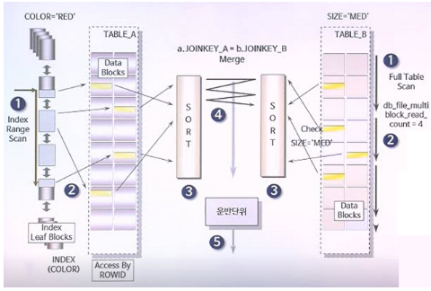
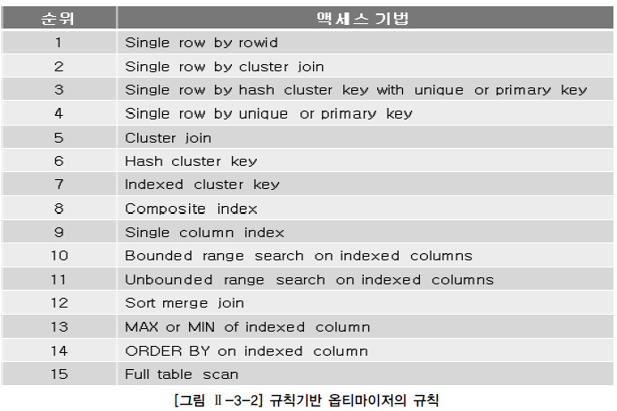
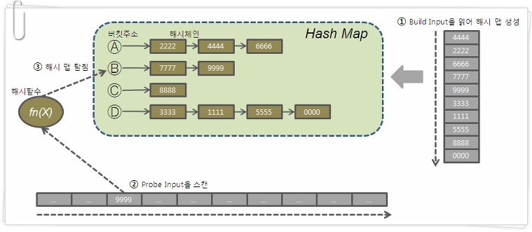

# 조인의 원리

- 중첩 루프 조인
- 정렬 병합 조인
- 해시 조인

## 1. 중첩 루프 조인(NLJ, Nested Loop Join)

- 중첩 for 문과 같은 원리로 조건에 맞는 조인을 하는 방법
- 단점
  - 랜덤 접근에 대한 비용이 많이 증가함
  - 대용량의 테이블에서는 사용하지 않음
- 조인해야 할 데이터가 많지 않은 경우에 유용하게 사용

### 1.1 NLJ 논리

1. 드라이빙 테이블 선정(기준이 되는 테이블)
2. where절에 정의된 검색 조건을 만족하는 데이터 걸러냄
3. 이 값을 가지고 조인 대상 테이블을 반복적으로 검색하면서 조인 조건을 만족하는 최종 결과값 얻어냄

```sql
SELECT e.name, e.sal // 근로자 이름과 월급 출력
FROM emp e, dept d // 근로자, 부서 테이블 조회
WHERE e.deptno = d.deptno; // 근로자 부서번호 맵핑
```
- employees 테이블이 드라이빙 테이블. 
- 옵티마이저는 맨 먼저 employees 테이블의 한 로우를 읽어 해당 로우의 department_id 값을 찾음
- 이 값을 기준으로 해서 departments 테이블에서 이와 같은 값을 가진 로우를 검색.
- 검색이 완료되면 다시 employees 테이블의 두 번째 로우를 읽음
- departments 테이블에서 데이터를 검색하며 이와 같은 방식을 반복

### 1.2 NLJ 특징

1. 첫 번째 로우를 받는 시간은 빠르지만, 전체 결과를 받기까지는 시간이 걸린다.
2. 메모리가 필요없는 조인 방법으로 추가적인 메모리 비용이 들지 않는다.
3. 전체적인 성능은 driving table에 있는 데이터가 몇 건인지가 관건이 되며, 드라이빙 테이블의 크기가 전체 쿼리를 수행하는데 큰 영향을 미친다.
4. 거의 대부분의 경우 inner table 검색시 인덱스를 사용해서 검색이 수행되므로 innser table의 인덱스 효율이 좋아야 한다.
5. 적은 수의 로우를 검색하는 경우 NLJ을 사용한다.
6. `일반적으로 조인 조건에 '=' 연산자가 사용될 경우 옵티마이저는 NLJ을 선택하게 된다.`

## 2. 정렬 병합 조인(SMJ Sort Merge Join)

- 각 테이블을 조인할 필드 기준으로 정렬한 후 조인 작업 수행
- **적용하는 경우**
  1. 조인할 때 적절한 인덱스가 없는 경우
  2. 대용량의 테이블을 조인할 경우
  3. 조인조건으로 범위 비교 연산자가 있을 경우 사용
  4. 인덱스 사용에 따른 랜덤엑세스의 오버헤드가 많은 경우
- 드라이빙 테이블이 별도로 존해하지 않으며, 두 테이블이 모두 독립적으로 동등한 레벨에 있게 된다.

### 2.1 SMJ 특징

1. 첫 번째 로우를 받는 시간은 좀 느리지만, 전체 로우가 반환되는 시간은 빠르다.
    -  두 테이블의 데이터를 각각 정렬한 뒤에 병합하므로 정렬작업이 끝날 때까지는 어떤 로우도 반환되지 않기 때문
2. 정렬 작업을 위해 추가적인 메모리를 사용함
   - 메모리 사용량은 `SORT_AREA_SIZE` 파라미터에 명시됨
   -  정렬 작업을 수행하면서 위 파라미터에 명시된 값 이상의 메모리를 사용할 경우, `TEMP 테이블스페이스를 사용`하게 되므로 `디스크 I/O가 발생`하게 됨
3. NLJ 보다는 많은 양의 데이터를 처리할 때 유리함
   - 메모리만 사용해서 정렬 작업을 수행한다면 `넓은 범위의 값을 검색하는데 유용`
4. 두 테이블 데이터의 `정렬 작업이 전체 성능에 영향`을 많이 끼침
   - SELECT 리스트에서 불필요한 컬럼은 제거해서 정렬 작업을 수행할 때 좀 더 부하를 적게 해줘야 함
5. 일반적으로 `조인조건에서` 사용되는 연산자가 >, >=, <, <= 와 `같은 비동등 연산자가 사용될 경우` 옵티마이저는 `SMJ를 사용`하게 된다.
6. 두 테이블의 사이즈 차이가 큰 경우 불리함



### 2.2 동작과정

1. 먼저 왼쪽과 오른쪽에 있는 TABLE_A와 TABLE_B를 동시에 ACCESS
2. 여기서 COLOR에 인덱스가 걸려있기에 TABLE_A는 인덱스 스캔
3. TABLE_B는 테이블 풀스 캔
4. 조회된 데이터들은 TABLE_A에서 읽은 데이터는 JOINKEY_A를 기준으로, TABLE_B에서 읽은 데이터는 JOINKEY_B를 통해 별도의 공간에서 SORT 작업
5. 두 개의 정렬 작업이 모두 완료되었다면 정렬한 결과를 차례로 Scan 해 나가면서 연결고리의 조건으로 Merge 하여 리턴

### 2.3 성능 개선 포인트

 1. access 속도 향상시키기
   - Access 할 때 FULL TABLE SCAN이냐 INDEX RANGE SCAN이냐 하는 등 테이블을 Access 하는 방법을 다양한 방법을 통해 최적화시키기
2. 정렬 속도 향상
   - 조인 조건 컬럼이 이미 정렬되어 있다면 정렬을 하는 작업을 단축시켜 검색 속도 향상에 도움이 될 것
3. 양쪽의 정렬까지 완료되는 속도 맞추기
4. SORT_AREA_SIZE 최적화
   - Temporary Table Space를 사용하면 딜레이가 생기므로 SORT_AREA_SIZE를 적당한 크기로 설정해두는 것이 속도 향상에 도움

## 3. 해시 조인(Hash Join)

- 조인될 두 테이블 중 하나를 **해시 테이블로** 선정하여 조인될 테이블의 조인 키 값을 해시 알고리즘으로 비교하여 매치되는 결과값을 얻는 방식
- 비용 기반 옵티마이저를 사용할 때만 사용될 수 있는 조인 방식
- `'=' 비교를 통한 조인에서만 사용`
- 주로 많은 양의 데이터를 조인해야 하는 경우에 주로 사용

### 3.1 규칙 기반 옵티마이저

- 규칙을 가지고 실행 계획을 생성
- 항상 인덱스를 사용하는 실행계획을 생성
- 규칙기반 옵티마이저가 조인 순서를 결정할 때는 조인 칼럼 인덱스의 존재 유무가 중요한 판단의 기준
   - 조인 칼럼에 대한 인덱스가 양쪽 테이블에 모두 존재한다면 앞에서 설명한 규칙에 따라 우선 순위가 높은 테이블을 선행 테이블(Driving Table)로 선택
   - 조인 칼럼에 모두 인덱스가 존재하지 않으면 FROM 절의 뒤에 나열된 테이블을 선행 테이블로 선택
   - 만약 조인 테이블의 우선 순위가 동일하다면 FROM 절에 나열된 테이블의 역순으로 선행 테이블을 선택
   - 양쪽 조인 칼럼에 모두 인덱스가 없는 경우 Sort Merge Join을 사용
   - 둘 중하나라도 조인 칼럼에 인덱스가 존재한다면 일반적으로 NL Join을 사용



- 규칙기반 옵티마이저의 규칙
- **주요한 규칙**
   1. **Single row by rowid** : **ROWID를 통해서 테이블에서 하나의 행을 액세스하는 방식**이다. ROWID는 행이 포함된 데이터 파일, 블록 등의 정보를 가지고 있기 때문에 다른 정보를 참조하지 않고도 바로 원하는 행을 액세스할 수 있다. **하나의 행을 액세스하는 가장 빠른 방법**이다.
   4. **Single row by unique or primary key** : **유일 인덱스(Unique Index)를 통해서 하나의 행을 액세스하는 방식**이다. 이 방식은 **인덱스를 먼저 액세스하고 인덱스에 존재하는 ROWID를 추출하여 테이블의 행을 액세스**한다.
   8. **Composite index** : **복합 인덱스에 동등(‘=’ 연산자) 조건으로 검색하는 경우**이다. 예를 들어, 만약 A+B 칼럼으로 복합 인덱스가 생성되어 있고, 조건절에서**WHERE A=10 AND B=1** 형태로 검색하는 방식.
      - **복합 인덱스 사이의 우선 순위 규칙**
         - **인덱스 구성 칼럼의 개수가 더 많고 해당 인덱스의 모든 구성 칼럼에 대해 ‘=’로 값이 주어질 수록** 우선순위가 더 높다. 
         - 예> A+B로 구성된 인덱스와 A+B+C로 구성된 인덱스가 각각 존재하고 조건절에서 A, B, C 칼럼 모두에 대해 ‘=’로 값이 주어진다면 A+B+C 인덱스가 우선 순위가 높다. 만약 조건절에서 A, B 칼럼에만 ‘=’로 값이 주어진다면 A+B는 인덱스의 모든 구성 칼럼에 대해 값이 주어지고 A+B+C 인덱스 입장에서는 인덱스의 일부 칼럼에 대해서만 값이 주어졌기 때문에 A+B 인덱스가 우선 순위가 높게 된다.
   9. **Single column index** : 단일 칼럼 인덱스에 ‘=’ 조건으로 검색하는 경우이다. 만약 A 칼럼에 단일 칼럼 인덱스가 생성되어 있고, 조건절에서 A=10 형태로 검색하는 방식이다.
   10. **Bounded range search on indexed columns** : **인덱스가 생성되어 있는 칼럼에 양쪽 범위를 한정하는 형태로 검색하는 방식** 
      - 이러한 연산자에는 BETWEEN, LIKE 등. 
      - 만약 A 칼럼에 인덱스가 생성되어 있고, A BETWEEN ‘10’ AND ‘20’ 또는 A LIKE '1%' 형태로 검색하는 방식이다.
   11. **Unbounded range search on indexed columns** : **인덱스가 생성되어 있는 칼럼에 한쪽 범위만 한정하는 형태로 검색하는 방식.** 
      - 이러한 연산자에는 >, >=, <, <= 등
      - 만약 A 칼럼에 인덱스가 생성되어 있고, A > '10' 또는 A < '20' 형태로 검색하는 방식
   15. **Full table scan** : 전체 테이블을 액세스하면서 조건절에 주어진 조건을 만족하는 행만을 결과로 추출

### 3.2 비용 기반 옵티마이저


- 단순한 몇 개의 규칙만으로 현실의 모든 사항을 정확히 예측할 수는 없다. 
- 비용기반 옵티마이저는 이러한 규칙기반 옵티마이저의 단점을 극복하기 위해서 출현
- **SQL문을 처리하는데 필요한 비용이 가장 적은 실행계획을 선택하는 방식**
   - `비용` : SQL문을 처리하기 위해 예상되는 소요시간 또는 자원 사용량을 의미
   - 비용을 예측하기 위해서 규칙기반 옵티마이저가 사용하지 않는 **테이블, 인덱스, 칼럼 등의 다양한 객체 통계정보와 시스템 통계정보 등을 이용**
      -  정확한 통계정보를 유지하는 것은 비용기반 최적화에서 중요한 요소

### 3.3 hash join 사용처

1. JOIN 컬럼에 적당한 인덱스가 없어 NL JOIN이 비효율적일 때
2. JOIN Access량이 많아 Random Access 부하가 심하여 NL JOIN이 비효율적일 때
3. Sort Merge Join을 하기에는 두 테이블이 너무 커 Sort 부하가 심할 때
4. 수행빈도가 낮고 쿼리 수행 시간이 오래 걸리는 대용량 테이블을 JOIN 할 때

### 3.4 HASH JOIN의 동작 방식


1. 빌드단계
   - 둘 중 작은 집합(Build Input)을 읽어 Hash Area에 해시 테이블을 생성한다. (해시 함수에서 리턴 받은 버킷 주소로 찾아가 해시 체인에 엔트리를 연결)
2. 프로브 단계
   - 반대쪽 큰 집합(Probe Input)을 읽어 해시 테이블을 탐색하면서 JOIN 한다.
   - 해시 함수에서 리턴 받은 버킷 주소로 찾아가 해시 체인을 스캔하면서 데이터를 찾는다.

### 예

- persons TABLE과 countries TABLE을 조인한다고 했을 때
1. 빌드 단계
   - 둘 중에 바이트가 작은 테이블을 bulid Input으로 정함
   - hash table을 생성해야 함. 조인에 사용되는 필드가 hash table의 키로 사용(countries.country_id)
2. 프로브 단계
   - 레코드 읽기를 시작하여 해시 테이블을 기반으로 각 레코드에서 persons.country_id에 일치하는 레코드를 찾아서 결과값을 반환
- 이를 통해 각 테이블은 한 번씩 읽게 되어 중첩해서 두 개의 테이블을 읽는 중첩 루프 조인보다 성능이 좋음

### 3.5 HASH JOIN의 성능 개선 포인트 

1. HASH TABLE을 만드는 과정을 효율화 한다.
   - HASH JOIN은 해시 테이블을 생성하는 비용이 수반되므로 이 과정을 효율화하는 것이 성능 개선에 있어 가장 중요합니다. 그렇기에 HASH TABLE로 만들 Build Input이 Hash Area에 담길 정도로 충분히 작아야 하며 Build Input 해시 키 칼럼에 중복 값이 거의 없어야 효율적인 동작을 기대할 수 있습니다.
2. CPU의 성능을 향상한다.
   - HASH BUCKET이 조인 집합에 구성되어 해시 함수 결과를 저장해야 하는데 기본적으로 `HASH_AREA_SIZE`에 지정된 크기만큼의 메모리가 할당되어 사용됩니다. 이러한 처리에는 많은 메모리와 CPU 자원을 소모하게 됩니다. 그렇기에 `CPU의 자원이` 넉넉하다면 다른 조인에 비해 보다 좋은 효율을 내지만 `부족한 상황에서는 다른 조인 방법보다 느려질 수도 있습니다`. 그러므로 CPU의 성능을 향상한다면 HASH JOIN의 성능을 향상할 수 있습니다.
3. 충분한 PGA 메모리 확보
   - Hash Area는 PGA 메모리에 할당되는데 Build Input이 HASH_AREA_SIZE를 초과하게 되면 가장 큰 순서대로 Hash Bucket이 Temporary Table Space로 내려가서 구성됩니다. 디스크로 내려간 Hash Bucket에 변경이 일어날 때마다 디스크 I/O가 발생하게 되어 성능이 현저하게 저하됩니다. 

 